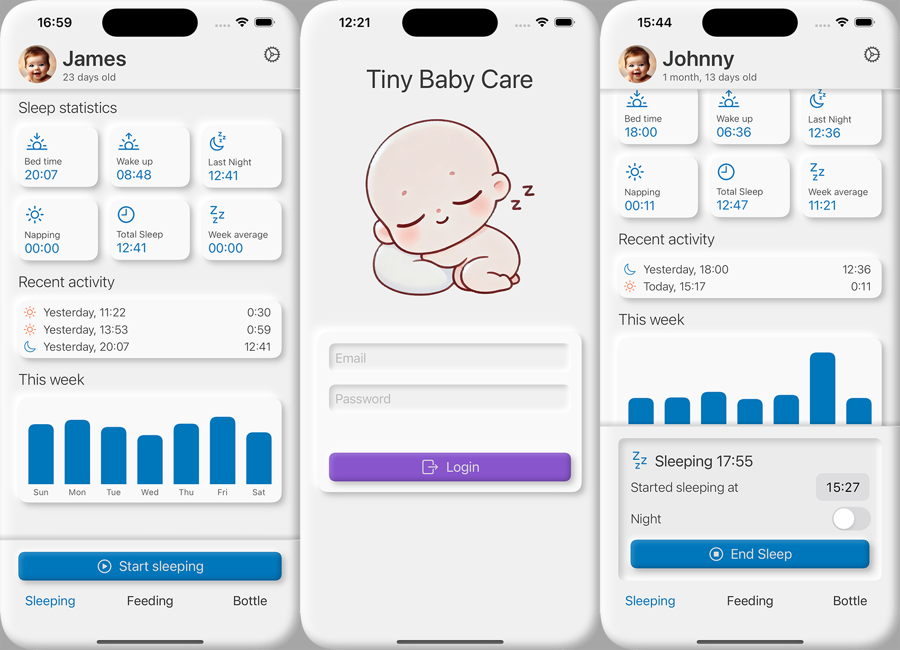

# Tiny Baby Care

Tiny Baby Care is an intuitive iOS app designed to help parents track and manage their baby's sleeping and
feeding habits. Data is securely synced to the cloud, enabling both parents to stay updated and coordinated.

Features:
- Sleep & Feeding Tracking: Easily log sleep sessions, breastfeeding, and bottle feedings
- Insightful Analytics: View statistics, graphs, and data about your baby's routines
- Real-Time Notifications: Receive instant updates when your baby starts or ends an activity

## Screenshots

## Tech Stack
iOS app:
- SwiftUI with custom UI components & animations
- Local data storage with SwiftData

Server backend
- Java Spring
- MySQL Database
